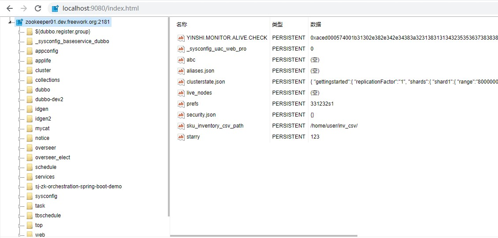

# ZK WEB UI

#### 说明
zk-web-ui 是一个基于web的`zookeeper`管理工具, 对 zk 节点提供增删改操作, 独立于 ccenter(基于ZK的配置中心).



#### 运行
标准 spring boot 项目, 直接使用 maven 构建即可
```
mvn clean compile package
```
找到 `target/zk-web-ui.jar`, 执行
```
java -jar -Dserver.port=2181 zk-web-ui.jar
```
* 注: `-Dserver.port=2181` 指定端口, 默认2181

访问: `http://localhost:2181/index.html` 或 访问: `http://localhost:2181/index.html?urls=zookeeper01.dev.freework.org:2181`

#### 快捷键说明

 | Operation     |  Scope           | Description                |
 | ------------- | ---------------- | -------------------------- |
 |  Alt + E      | Global           | Open 'Expand' window       |
 |  ESC          | Global           | Close 'Expand' window      |
 |  Alt + R      | Tree             | Refresh the selected node  |
 |  Alt + D      | Tree             | Dump the selected node     |
 |  Alt + Insert | Table            | Create a new leaf(node)    |
 |  Alt + Delete | Table            | Delete the selected leaf   |
 |  Double click | Table cell value | Edit the clicked value     |
 |  Alt + S      | Global           | Save all unsaved leaf data |
 |  Alt + 1      | Global           | Tree focus                 |